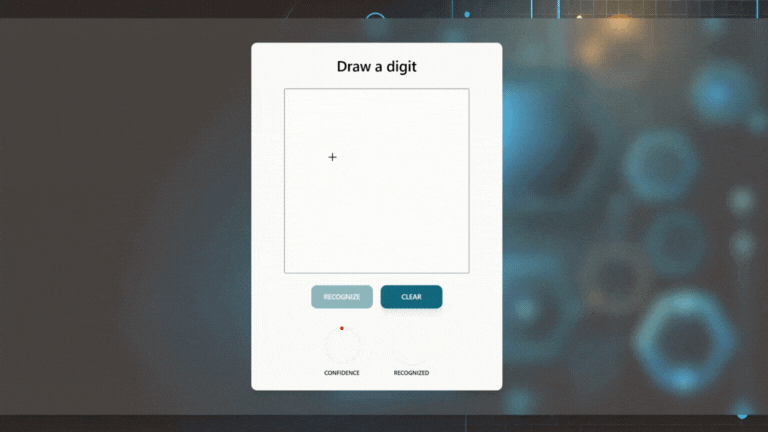

# Digit recognizer

## About project
This project is a complete AI-powered progresive web application for recognizing handwritten digits in real-time using a convolutional neural network. It combines deep learning, which I learn as a hobbyist, and web development, which I do professionally. It’s a showcase of skills in:
- designing and training AI models,
- creating a mobile-friendly, progressive web application,
- building full-stack production-ready application hosted on a server,
- connecting AI technologies with web applications.

## Preview
Check out the live demo:<br>
https://digitrecognizer.lukaszsliwinski.pl



Draw a digit and see real-time predictions.

## Used technologies and tools
**AI development:**
- Python / Pytorch / Jupyter Notebook
- Google Colab for training
- OpenVINO for model testing

**Web development:**
- Python / Flask for backend
- TypeScript / React / Tailwind CSS for frontend

**Hosting:**
- VPS server with Ubuntu
- Nginx for reverse proxy

## Development process
**Development steps:**
1. Design and implement a convolutional neural network model using Pytorch.
2. Train and validate model on the MNIST dataset.
3. Deploy model using Flask backend.
4. Create app using React Typescript and Tailwindcss for drawing a digit in the app.
5. Create mobile view and PWA to install app on smartphone.
6. Test and optimization - tune the model by experimenting with batch size, learning rate, and epochs to minimize the gap between training and validation accuracy.

**Insights:**
1. Increasing the batch size leads to smaller gap between training and validation accuracy.
2. Training for more than 40 epochs showed no improvement in model performance.
3. The model doesn't recognize digits from images with non-white backgrounds.
4. For accurate recognition, the digit’s line width should be at least 3px.

## Run app locally
**Requirements:**
- Python v3.11
- Node.js v18
- npm v10

**Steps to run:**
1. Navigate to the client directory and install front-end dependencies:
```
cd client
npm install
```
2. Build the React app:
```
npm run build
```
3. Navigate to the server directory and create a virtual environment:
```
cd ../server
python -m venv digit-recognizer-venv
digit-recognizer-venv\scripts\activate
```
4. Install required Python libraries
```
pip install -r requirements.txt
```
5. Run the Flask app
```
flask run
```
6. Access the app by opening http://localhost:5000/ in your browser.

## Test model locally on Intel NPU
Testing the model on an Intel NPU requires compatible hardware and proper configuration to utilize the NPU's capabilities. Steps:
1. Ensure the Python virtual environment is active.
2. Navigate to the test directory:
```
cd test
```
3. Use the provided test images from server/test/data or add your own. Update the image path in test_model.py file (last line, 2nd parameter in test_model() function).
4. Run the script:
```
python test_model.py
```

## Train model using Google Colab
Use Google Colab for its free GPU support to accelerate training:  
1. Open the notebook from server/model/train_model_notebook.ipynb script in Google Colab.
2. Upload server/app/cnn_structure.py to the workspace.
3. Modify parameters if needed (learning rate, epochs, batch size).
4. Run the script.